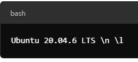
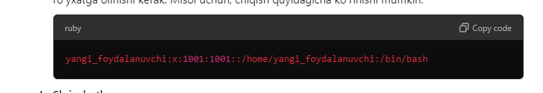
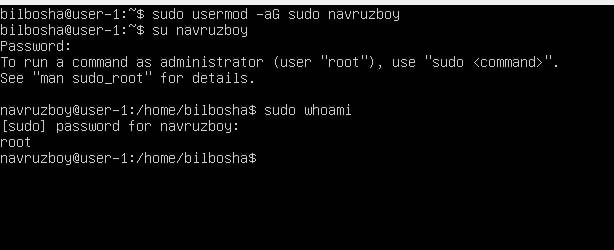

## Part 1. Operatsion tizimni o‘rnatish


Ubuntu 20.04 Server LTS ni GUI (grafik interfeys) siz o'rnating. (VirtualBox dan foydalaning).

Ubuntu versiyasini quyidagi buyruq orqali tekshiring:
```bash
cat /etc/issue
```
### Natija:



## Part 2. Foydalanuvchini yaratish

O'rnatish jarayonida yaratilgan foydalanuvchidan boshqa yangi foydalanuvchini yaratishingiz kerak. 
Foydalanuvchi adm guruhiga qo'shilishi kerak.

Yangi foydalanuvchi cat `/etc/passwd` buyruqining chiqishida ko'rinishi kerak:

   ```bash
   cat /etc/passwd
   ```

### Natija:         
**Foydalanuvchini yaratish:**

Terminalni oching va foydalanuvchi yaratish uchun quyidagi buyruqni bajaring 
(foydalanuvchi nomi sifatida masalan, `newuser` deb yozing):
```bash
   sudo adduser newuser
   ```



Keyin foydalanuvchini adm guruhiga qo'shish uchun quyidagi buyruqni bajaring:
```bash
   sudo usermod -aG adm newuser
   ```


**Foydalanuvchini `/etc/passwd` faylida tekshirish:**
```bash
   /etc/passwd
   ```


## Part 3. Tarmoqni sozlash

### Natija:

***Mashinaning nomini user-1 qilib o'rnating .**


**Hozirgi joylashuvingizga mos vaqt zonasini o'rnating.**

```bash
sudo timedatectl set-timezone Asia/Tashkent
   ```

**Konsol buyrug‘i yordamida tarmoq interfeyslari nomlarini chiqarish.**

Eng asosiy virtual interfeyslaridan biri - `lo`. Bu lokal interfeys bo'lib, dasturlarga ushbu kompyuterga murojaat qilish imkonini beradi. 

**Konsol buyrug'i yordamida siz ishlayotgan qurilmaning IP manzilini DHCP serveridan oling.**

**O'rnatish**.


**Konsol buyrug'i yordamida siz ishlayotgan qurilmaning IP manzilini DHCP serveridan oling.**

**DHCP — bu dinamik host konfiguratsiya protokoli (Dynamic Host Configuration Protocol) bo'lib, u IT-infrastrukturada har bir yangi qurilmaning tarmoq parametrlarini avtomatik ravishda belgilaydi.**

**Tashqi IP manzilini (ip) va ichki IP manzilini (gw) — ya'ni, standart IP manzilini ekranga chiqarish.**

**Statik (qo'lda belgilangan, DHCP serveridan olinmagan) IP, gw va DNS sozlamalarini o'rnating (masalan, 1.1.1.1 yoki 8.8.8.8 kabi ochiq DNS serverlardan foydalaning).**


**Qayta yoqilgandan so'ng.**


## Part 4. OS yangilash

**Sistemani paketlarini vazifani bajarish paytidagi oxirgi versiyasiga yangilang.**


## Part 5. Sudo komandasi foydalanish

**[Part 1](#Part-1)da yaratilgan foydalanuvchiga sudo komandasini bajarishga ruxsat berish.**

**Part 2 da yaratilgan foydalanuvchi nomidan OS hostname ni o'zgartirish (sudo yordamida).**

**sudo — bu yordamchi dastur bo'lib, vaqtinchalik ravishda imtiyozlarni oshirish va tizimni boshqarish vazifalarini bajarishga imkon beradi.**


