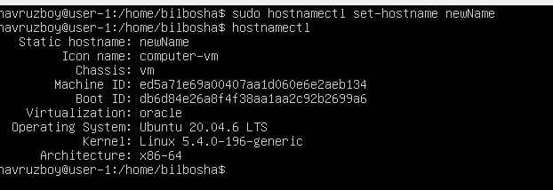
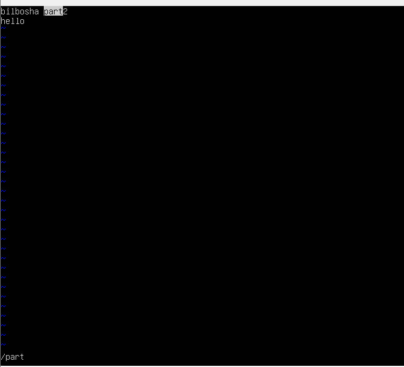
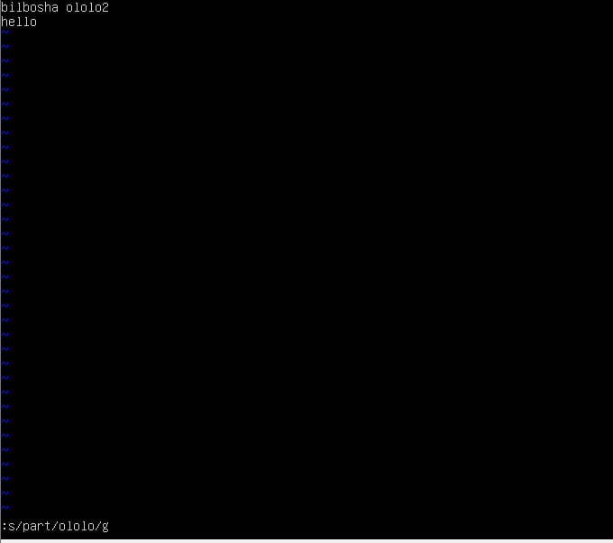

## Contents
1.[Part 1](#part-1-operatsion-tizimni-ornatish)

2.[Part 2](#part-2-foydalanuvchini-yaratish)

3.[Part 3](#part-3-tarmoqni-sozlash)

4.[Part 4](#part-4-os-yangilash)

5.[Part 5](#part-5-sudo-komandasi-foydalanish)

6.[Part 6](#part-6-vaqt-xizmatini-ornatish-va-sozlash)

7.[Part 7](#part-7matn-muharrirlarini-ornatish-va-ishlatish)

8.[Part 8](#part-8sshd-xizmatini-ornatish-va-asosiy-sozlash)

9.[Part 9](#part-9top-va-htop-utilitalarini-ornatish-va-ishlatish)

10.[Part 10](#part-10fdisk-utilitasidan-foydalanish)

11.[Part 11](#part-11df-utilitasidan-foydalanish)

12.[Part 12](#part-12du-utilitasidan-foydalanish)

13.[Part 13](#part-13ncdu-utilitasini-ornatish-va-undan-foydalanish)

14.[Part 14](#part-14tizim-jurnalari-bilan-ishlash)

15.[Part 15](#part-15cron-ish-rejalashtiruvchisi)


## Part 1. Operatsion tizimni o‘rnatish


Ubuntu 20.04 Server LTS ni GUI (grafik interfeys) siz o'rnating. (VirtualBox dan foydalaning).

Ubuntu versiyasini quyidagi buyruq orqali tekshiring:
```bash
cat /etc/issue
```
### Natija:


## Part 2. Foydalanuvchini yaratish

O'rnatish jarayonida yaratilgan foydalanuvchidan boshqa yangi foydalanuvchini yaratishingiz kerak. 
Foydalanuvchi adm guruhiga qo'shilishi kerak.

Yangi foydalanuvchi cat `/etc/passwd` buyruqining chiqishida ko'rinishi kerak:

   ```bash
   cat /etc/passwd
   ```

### Natija:         
**Foydalanuvchini yaratish:**

Terminalni oching va foydalanuvchi yaratish uchun quyidagi buyruqni bajaring 
(foydalanuvchi nomi sifatida masalan, `newuser` deb yozing):
```bash
   sudo adduser newuser
   ```


Keyin foydalanuvchini adm guruhiga qo'shish uchun quyidagi buyruqni bajaring:
```bash
   sudo usermod -aG adm newuser
   ```


**Foydalanuvchini `/etc/passwd` faylida tekshirish:**
```bash
   /etc/passwd
   ```


## Part 3. Tarmoqni sozlash

### Natija:

***Mashinaning nomini user-1 qilib o'rnating .**


**Hozirgi joylashuvingizga mos vaqt zonasini o'rnating.**

```bash
sudo timedatectl set-timezone Asia/Tashkent
   ```

**Konsol buyrug‘i yordamida tarmoq interfeyslari nomlarini chiqarish.**

Eng asosiy virtual interfeyslaridan biri - `lo`. Bu lokal interfeys bo'lib, dasturlarga ushbu kompyuterga murojaat qilish imkonini beradi. 

**Konsol buyrug'i yordamida siz ishlayotgan qurilmaning IP manzilini DHCP serveridan oling.**

**O'rnatish**.


**Konsol buyrug'i yordamida siz ishlayotgan qurilmaning IP manzilini DHCP serveridan oling.**


**DHCP — bu dinamik host konfiguratsiya protokoli (Dynamic Host Configuration Protocol) bo'lib, u IT-infrastrukturada har bir yangi qurilmaning tarmoq parametrlarini avtomatik ravishda belgilaydi.**


**Tashqi IP manzilini (ip) va ichki IP manzilini (gw) — ya'ni, standart IP manzilini ekranga chiqarish.**


**Statik (qo'lda belgilangan, DHCP serveridan olinmagan) IP, gw va DNS sozlamalarini o'rnating (masalan, 1.1.1.1 yoki 8.8.8.8 kabi ochiq DNS serverlardan foydalaning).**


**Qayta yoqilgandan so'ng.**


## Part 4. OS yangilash

**Sistemani paketlarini vazifani bajarish paytidagi oxirgi versiyasiga yangilang.**


## Part 5. Sudo komandasi foydalanish

**[Part 1](#part-1-operatsion-tizimni-ornatish)da yaratilgan foydalanuvchiga sudo komandasini bajarishga ruxsat berish.**


**[Part 2](#part-2-foydalanuvchini-yaratish) da yaratilgan foydalanuvchi nomidan OS hostname ni o'zgartirish (sudo yordamida).**

**sudo — bu yordamchi dastur bo'lib, vaqtinchalik ravishda imtiyozlarni oshirish va tizimni boshqarish vazifalarini bajarishga imkon beradi.**
## Part 6. Vaqt xizmatini o'rnatish va sozlash

**Avtomatik vaqtni sinxronizatsiya qilish xizmatini sozlash.**


**Quyidagi buyruqning natijasida NTPSynchronized=yes bo'lishi kerak: `timedatectl show`.**


## Part 7.Matn muharrirlarini o'rnatish va ishlatish.
**VIM matn muharririni o‘rnating (+ istalgan ikkitasini tanlang: NANO, MCEDIT, JOE va boshqalar).**


**Har uchta tanlangan muharrirni ishlatib, test_X.txt faylini yarating, bunda X fayl yaratilgan muharrir nomi bo'ladi. Fayl ichiga o'zingizning taxallusingizni yozing va faylni o'zgartirishlarni saqlagan holda yoping.**


vim7

#### Chiqish:esc+:wq

nano


#### Chiqish: control+o+x

mcedit


Chiqish: f2+f10

***Har uchta tanlangan muharrirni ishlatib, faylni tahrirlash uchun oching, faylni tahrirlang va taxallus o‘rniga "21 School 21" qatorini yozing, so‘ngra faylni o‘zgartirishlarsiz yoping. vim**


#### Chiqish:q!

nano

Chiqish: control+x

mcedit


#### Chiqish: f10

**Har uchta tanlangan muharrirda faylni yana bir bor tahrirlab chiqing (oldingi qadamga o‘xshash tarzda), so'ngra fayl mazmunida so‘zlarni qidirish va ularni boshqa so‘zga almashtirish funksiyalarini o‘rganing.**

#### vim Qidirish


#### O'rnini bosish


**/-Qidirish**

**nano Qidirish**


#### O'rnini bosish - ``control/``



#### Qidirish ``control w``

``mcedit``

#### Qidirish -f7


#### Qidirish -f4


## Part 8.SSHD xizmatini o'rnatish va asosiy sozlash 

**SSHd xizmatini o'rnatish.**

**Repository yangilanishi.**


#### SSH o'rnatish

#### OpenSSH o'rnatish


#### Tizim yuklanayotganda xizmatni avtomatik ishga tushirishni qo'shish.


#### SSH holati.

#### SSHd xizmatini 2022-portga qayta sozlash:


#### SSH-ni o'zgarishlarni saqlash uchun qayta ishga tushirish

#### `ps` buyrug'idan foydalanib, sshd jarayonining mavjudligini ko'rsatish uchun kalitlarni tanlash kerak.


`-tan:`

`t-TCP `protokoli bo'yicha

`a`- Barcha ulanishlar va kutilayotgan portlarni ko'rsatish.

`n`- Manzillar va port raqamlarini raqamli formatda ko'rsatish.

Ustunlar:

`Recv-Q `- Ushbu tugunda/kompyuterda qabul qilish navbatlarida turgan so'rovlar soni

`Send-Q` - Ushbu tugunda/kompyuterda jo'natish navbatlarida turgan so'rovlar soni

`Local Address` - Mahalliy soketning manzili va port raqami

`Foreign Address` - Uzoq soket manzili va port raqami

`State `- Soketning holati

Agar manzil sifatida 0.0.0.0 ko'rsatilgan bo'lsa, bu "har qanday manzil" degan ma'noni anglatadi, ya'ni bu ulanishda ushbu kompyuterda mavjud bo'lgan barcha IP-manzillar ishlatilishi mumkin.


**-tps -aux | grep sshd** chiqishi:

- **ps** — sizning serveringizda hozirgi jarayonlarning ro'yxatini jadval ko'rinishida chiqaradi.
  
- **a** — fon jarayonlaridan tashqari barcha jarayonlarni tanlaydi.
  
- **u** — foydalanuvchi jarayonlarini tanlaydi.
  
- **x** — ps ga sizga tegishli barcha jarayonlarni ro'yxatga olishni buyuradi.


## Part 9.Top va Htop utilitalarini o'rnatish va ishlatish

**top va htop yordamchilarini o'rnating va ishga tushiring**

`top`


`uptime`

**Avtorizatsiyadan o'tgan foydalanuvchilar soni**


**Tizimning umumiy yuklanishi**

**Umumiy jarayonlar soni**

**CPU yuklanishi**

**Xotira yuklanishi**

**Eng ko'p xotira egallovchi jarayonning PID raqami**

**Eng ko'p protsessor vaqti sarflovchi jarayonning ``pid``si**

**htop PID bo'yicha saralangan**

**PERCENT_CPU** 

**PERCENT_MEM**

**TIME**

**sshd jarayoni uchun filtrlash**

**Qidiruv yordamida topilgan syslog jarayoni bilan**

**`hostname`, soat va ``uptime`` chiqishini qo'shgan holda**


## Part 10.Fdisk utilitasidan foydalanish

**fdisk -l buyrug'ini ishga tushirish.**

### Ism

**Hajmi 8.25 GB** 

**Sektorlar soni 88541755744**


## Part 11.Df utilitasidan foydalanish

## Part 12.Du utilitasidan foydalanish

## Part 13.Ncdu utilitasini o'rnatish va undan foydalanish

## Part 14.Tizim jurnalari bilan ishlash

## Part 15.CRON ish rejalashtiruvchisi 